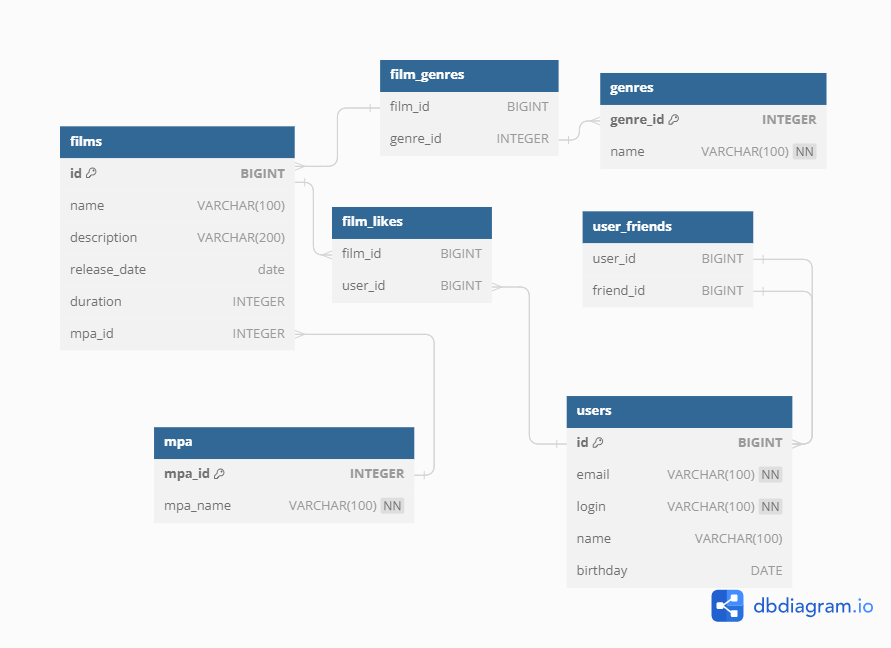

# Filmorate
___  
Учебный проект. RESTful API для сервиса, который будет работать с фильмами, рейтингом от пользователей и рекомендациями  
фильмов к просмотру.
___
### Стек:

- Java 11
- Spring Boot
- Maven
- JUnit
- Lombok
- JDBC
- H2
___
### URL API при локальном запуске
`http://localhost:8080`

### Реализованы эндпоинты:

#### */films*
- `POST` - создание фильма
- `PUT` - редактирование фильма
- `PUT /films/{id}/like/{userId}` - поставить лайк фильму
- `GET` - получение списка всех фильмов
- `GET /films/{id}` - получение информации о фильме по id
- `GET /films/popular?count={count}` - получить список самых популярных фильмов по количеству лайков. Если значение   
  параметра count не задано, возвращает первые 10
- `DELETE /films/{id}` - удаление фильма по id
- `DELETE /films/{id}/like/{userId}` - удаление лайка у фильма
#### */users*
- `POST` - создание пользователя
- `PUT` - редактирование пользователя
- `PUT /users/{id}/friends/{friendId}` - добавление в друзья
- `GET` - получение списка всех пользователей
- `GET /users/{id}` - получение информации о пользователе по id
- `GET /users/{id}/friends` - получение списка друзей пользователя
- `GET /users/{id}/friends/common/{otherId}` - получение списка общих друзей
- `DELETE /users/{id}/friends/{friendId}` - удаление из друзей
#### */genres*
- `GET` - получение список всех жанров
- `GET /genres/{id}` - получение информации о жанре по id
#### */mpa*
- `GET` - получение списка всех рейтингов
- `GET /mpa/{id}` - получение информации о рейтинге по id
___
#### Пример `POST`-запроса на эндпоинт /users

```json
{
  "login": "dolore",
  "name": "Nick Name",
  "email": "mail@mail.ru",
  "birthday": "1946-08-20"
}
```

#### Пример `POST`-запроса на эндпоинт /films
```json
{
  "name": "New film",
  "releaseDate": "1999-04-30",
  "description": "New film about friends",
  "duration": 120,
  "rate": 4,
  "mpa": { "id": 3},
  "genres": [{ "id": 1}]
}
```
___

#### Диаграмма базы данных



